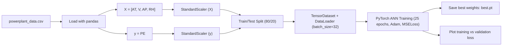
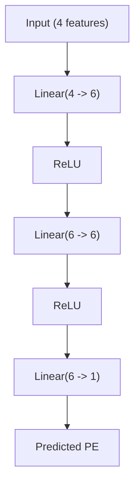

# PlantPulse

PlantPulse is a compact deep-learning project that predicts **power plant electrical output (`PE`)** from environmental measurements.

## Project Snapshot

- **Problem type:** Tabular regression
- **Frameworks:** PyTorch, scikit-learn, pandas, matplotlib
- **Input features:** `AT`, `V`, `AP`, `RH`
- **Target:** `PE`
- **Split:** 80/20 train-test (`random_state=42`)
- **Best recorded validation loss:** `~0.0564` (scaled MSE space)

## System Flow



## Model Architecture



## Repository Structure

```text
PlantPulse/
├── PlantPulse.ipynb        # End-to-end workflow: preprocessing, training, plots
├── powerplant_data.csv     # Tabular dataset
└── best.pt                 # Best model checkpoint saved during training
```

## Quick Start

1. Create and activate a Python environment.
2. Install dependencies:

```bash
pip install torch pandas scikit-learn matplotlib jupyter
```

3. Launch Jupyter and open the notebook:

```bash
jupyter notebook PlantPulse.ipynb
```

## Training Configuration (Notebook)

- Loss: `nn.MSELoss()`
- Optimizer: `Adam`
- Epochs: `25`
- Batch size: `32`
- Checkpointing: saves model state dict to `best.pt` when validation loss improves

## Notes

- Loss is reported on **scaled targets**, since `y` is standardized before training.
- To report error in original `PE` units, predictions should be inverse-transformed with the target scaler.

